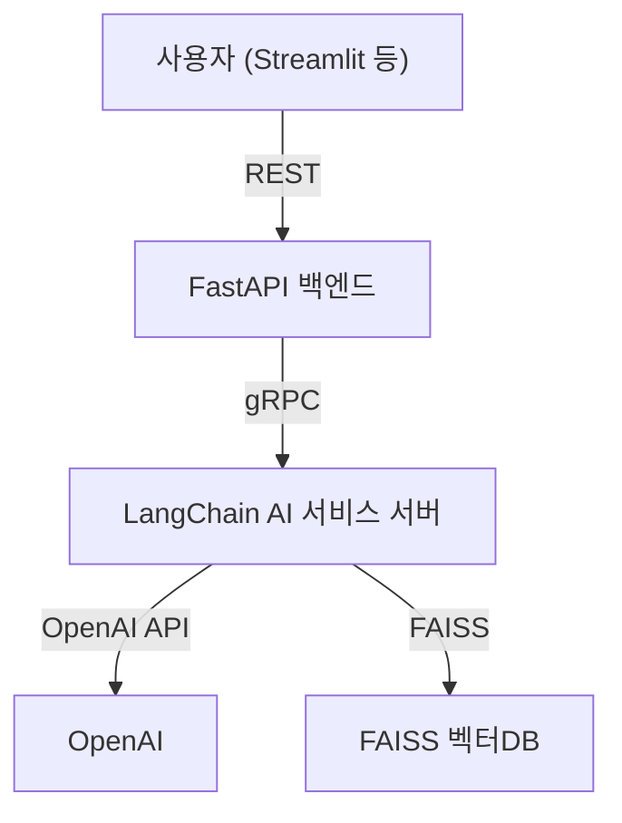

# 🧠 my_velog_agent
---
내가 벨로그 쓰다가 만드는 agent

## 프로젝트 목표
- Gmail, Slack, 회의록 등 다양한 소스의 텍스트를 요약하고, 노션/벨로그에 자동 포스팅하는 AI 에이전트 구축
- 내가 약한 부분들 다시 봐야 하는 부분들 특화해서 정리
- LangChain과 FAISS를 활용한 기억(컨텍스트) 기능 포함
- 여러 API 연동 및 사용자 인증(로그인) 시스템 제공
- 프론트엔드는 Streamlit, 백엔드는 FastAPI 기반

---

## 전체 아키텍처

- **FastAPI**: 백엔드 API 서버 (로그인/인증, 각종 API 연동, LangChain 체인 실행)
- **LangChain + FAISS**: LLM 워크플로우, 벡터DB(FAISS) 관리, 요약/분석 등
- **Streamlit**: 프론트엔드 대시보드 (FastAPI와 통신, 결과 표시, 파일 업로드 등)

---

## 주요 기능

| 분류         | 기능                | 설명                                              |
|--------------|---------------------|---------------------------------------------------|
| 📩 이메일 요약 | Gmail에서 이메일 요약 | Gmail API로 이메일 가져와 OpenAI로 요약           |
| 💬 슬랙 요약   | Slack 대화 요약      | Slack 채널 대화 내역을 요약                        |
| 📄 회의록 분석 | 회의록 텍스트 요약   | 업로드한 회의록 텍스트 요약 및 TODO 추출           |
| 🗒️ 노션 연동  | 노션 자동 작성       | 요약 결과를 노션 특정 페이지에 자동 작성           |
| ✍️ 벨로그 포스팅| 벨로그 자동 발행      | 요약된 내용 기반으로 벨로그 포스트 작성 및 발행     |
| 🧠 기억 기능   | 벡터DB 기억           | 이전 대화/요약을 벡터로 저장, 컨텍스트 유지        |

---

## 폴더 구조

---

## gRPC 기반 AI 서비스 서버

---

## 사용 기술 스택
- Python, FastAPI, LangChain, FAISS, Streamlit, gRPC, OpenAI API, 각종 외부 API(Gmail, Slack, Notion 등)
